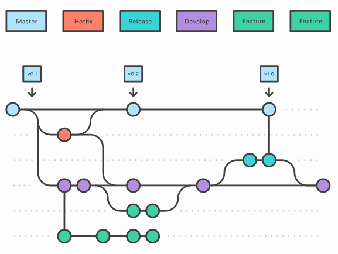

# new-pipeline
the version control system we will be using in this project is github.
everyone is require to signup for github.
the strategy we will be using is gitflow in this project.

the following diagram represent a pictorial discription of the gitflow.

    

    Master

This is the live branch of the project. This is a production code. You need be careful when you commit this branch.
Hotfix
When you need to solve something in production code you can use Hotfix branch and open pull-request for master branch.

Develop

This branch same with master branch but you are using this branch for new feature developments. You can’t commit directly but it’s a better than use master branch. You clone this branch from master only one time. Same time you need merge hotfix to this branch.

Feature

Feature is the branch for the our new features on project. You clone new branch from development and start coding new features on this branch. After you will open pull-request on development branch and after that your code will be merged on development branch. But you need to be stay sync with development for avoid conflicts.

Release

When you finish all new feature development on dev branch you need test new features. You can create release branch and test changes before merge on production code. This environment named as a Staging. It means before production last chance to test everything.
